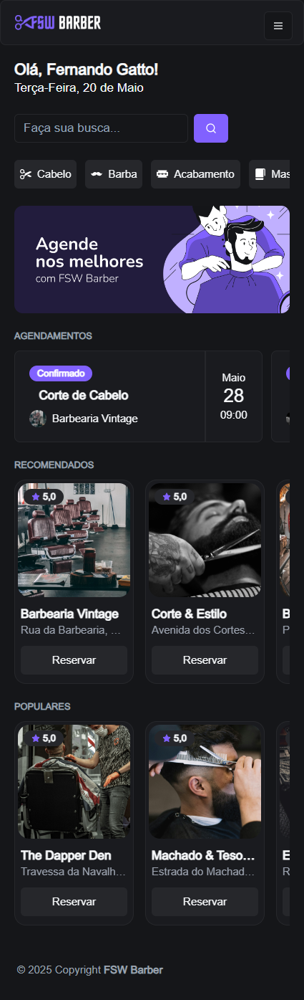
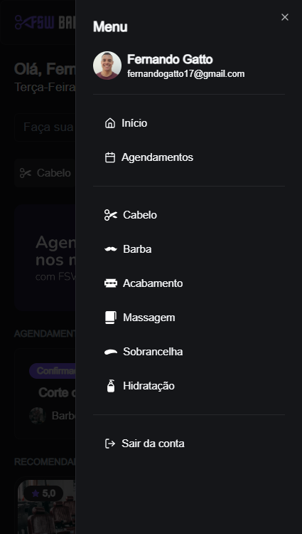
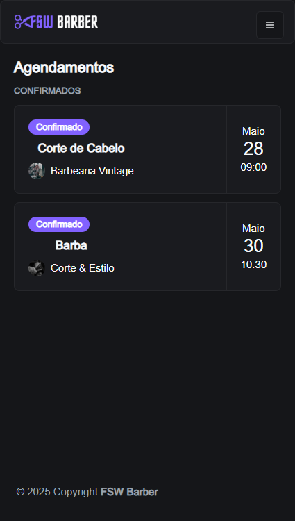
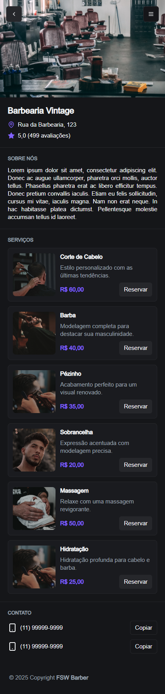

> This is a NextJS project made for barbershop scheduling.

## 🔗 Table of contents

- [Technologies](#technologies)
- [Documentation](#documentation)
- [Installation](#installation)
- [Getting start](#start)
- [Project](#project)
- [Contribute](#contribute)

## 📌 Technologies <a name="technologies"/>

- [NextJS](https://nextjs.org/)
- [Next Auth](https://next-auth.js.org/)
- [ESLint](https://eslint.org/)
- [Prettier](https://prettier.io/)
- [React Hook Form](https://www.react-hook-form.com/)
- [Zod](https://zod.dev/)
- [Prisma ORM](https://www.prisma.io/)
- [Tailwindcss](https://tailwindcss.com/)
- [Shadcn UI](https://ui.shadcn.com/)

## 🧠 Documentation <a name="documentation"/>

```bash
.
├── app                      # Core application code
│   ├── actions              # Action handlers or business logic
│   ├── components           # Reusable UI components
│   ├── constants            # Constant values used across the app
│   ├── data-access          # Data access utilities and functions
│   ├── interfaces           # TypeScript interfaces and type definitions
│   ├── lib                  # Utility functions or libraries
│   ├── providers            # Context providers for state management
│   ├── api                  # API-related code (endpoints, clients)
│   ├── barbershops          # Barbershop-specific features
│   ├── bookings             # Booking-related features
│   ├── favicon.ico          # Application favicon
│   ├── globals.css          # Global CSS styles
│   ├── layout.tsx           # Main layout component
│   └── page.tsx             # Main page component
├── prisma                   # Prisma ORM schema and migrations
├── public                   # Static assets (images, fonts, etc.)
├── .eslintrc.json           # ESLint configuration
├── .gitignore               # Git ignore file
├── lintstagedrc.json        # Lint-staged configuration
├── prettierc.json           # Prettier configuration
├── components.json          # Component metadata or config
├── next.config.mjs          # Next.js configuration
├── package-lock.json        # npm dependency lock file
├── package.json             # Project metadata and dependencies
├── postcss.config.mjs       # PostCSS configuration (e.g., for Tailwind)
├── README.md                # Project documentation (this file)
├── tailwind.config.ts       # Tailwind CSS configuration
└── tsconfig.json            # TypeScript configuration
```

## 📂 Installation <a name="installation"/>

First of all, it is important that you have installed [npm](https://www.npmjs.com/).

So, run this command in terminal to clone the project via HTTPS:

```bash
git clone https://github.com/fernandogatto/fsc-barber-v2
```

**Install dependencies**

```bash
npm install
```

## 🚀 Getting start <a name="start"/>

The project is deployed [here](https://fsc-barber-v2.vercel.app/):

To run on localhost, follow this commands in terminal:

```bash
npx prisma migrate deploy
npx prisma db seed
npx prisma generate
npm run dev
```

The project will open on http://localhost:3000.

## 💻 Project <a name="project"/>

Home page:



Menu:



Bookings page:



Booking details:


Confirm dialog:


Barbershop page:



## 🎨 Layout

To see the layout on Figma click [here](https://www.figma.com/design/ByDjVh7THsTnsSVRKNN8yy/FSW-5.0--Live-?node-id=1-9&p=f&t=FFSBNxUIpjUXLJlV-0).

## 👍 Contribute <a name="contribute"/>

- Fork this repository.
- Create a branch with your resource: `git checkout -b feature/my-feature`
- Submit changes: `git commit -m "feat: My new feature"`
- Push your branch: `git push origin feature/my-feature`

Build with 💙 by [Fernando Gatto](https://github.com/fernandogatto/).
